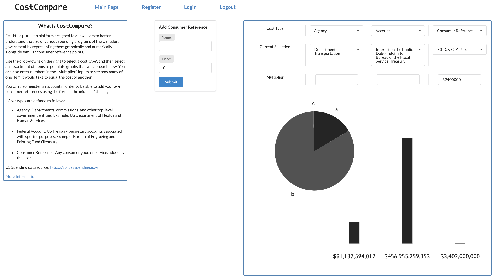

# Capstone
## CostCompare

### Scope
CostCompare is an app that allows the user to frame the cost of various federal spending programs to reference points (both pre-populated and user-added) that would be familiar to the average consumer. For example:
* How does the US defense budget compare to total spending on food in the US?
* What is the distribution of spending amongst various top-level federal agencies and their subsidiaries?
* How much money per taxpayer is spent on the Export-Import Bank?

The app would serve to help users become more familiar with the magnitude of the numbers behind important government spending questions in order to better inform their opinions on these issues.

### User Stories
User will be able to:
* Use search bars/drop-downs to create custom graphs comparing different government programs and consumer references
 * Government programs: Will contain both top-level federal agencies and the US Treasury budget accounts for specific programs
 * Consumer references: Will contain a variety of common consumer products, ranging from a Big Mac to the median house. User will also be able to add their own items after logging in

#### Heroku Deployment Note:
* Login and consumer reference addition temporarily disabled by Heroku settings

### API
[CostCompare API](https://github.com/LehmanBrother/GA-WDI-Capstone-Back)

### Screenshot

### External Resources
* [USA Spending API](https://api.usaspending.gov/)

This project was bootstrapped with [Create React App](https://github.com/facebook/create-react-app).

## Available Scripts

In the project directory, you can run:

### `npm start`

Runs the app in the development mode. 
Open [http://localhost:3000](http://localhost:3000) to view it in the browser.

The page will reload if you make edits. 
You will also see any lint errors in the console.

### `npm test`

Launches the test runner in the interactive watch mode. 
See the section about [running tests](https://facebook.github.io/create-react-app/docs/running-tests) for more information.

### `npm run build`

Builds the app for production to the `build` folder. 
It correctly bundles React in production mode and optimizes the build for the best performance.

The build is minified and the filenames include the hashes. 
Your app is ready to be deployed!

See the section about [deployment](https://facebook.github.io/create-react-app/docs/deployment) for more information.

### `npm run eject`

**Note: this is a one-way operation. Once you `eject`, you can’t go back!**

If you aren’t satisfied with the build tool and configuration choices, you can `eject` at any time. This command will remove the single build dependency from your project.

Instead, it will copy all the configuration files and the transitive dependencies (Webpack, Babel, ESLint, etc) right into your project so you have full control over them. All of the commands except `eject` will still work, but they will point to the copied scripts so you can tweak them. At this point you’re on your own.

You don’t have to ever use `eject`. The curated feature set is suitable for small and middle deployments, and you shouldn’t feel obligated to use this feature. However we understand that this tool wouldn’t be useful if you couldn’t customize it when you are ready for it.

## Learn More

You can learn more in the [Create React App documentation](https://facebook.github.io/create-react-app/docs/getting-started).

To learn React, check out the [React documentation](https://reactjs.org/).
